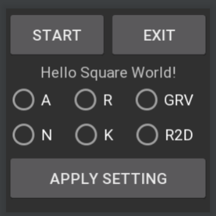

Wear - Android Smartwatch sensor data CVT
=============
CVT: collection and visualization tool

## Android smartwatch sensor data collection and visualization tool. - Wear Part

If you are looking for a tool to see the sensor values from the Android Smartwatch in graph form,
I recommend using this project on the Wear-side and the [PC-side project](https://github.com/Junsung-Kim/PC-Android-Smartwatch-CVT "PC-side project").

Author: Jun Sung Kim (jskim.uoscs@gmail.com) 

### Functions
 - You can connect android smartwatches with pc(or mac) via bluetooth connection.
 - You can connect one or more Android Smartwatches to your computer to view the sensor values of each watch.
 - This project contains capturing sensor data (accelerometer, rotation vector sensor, game rotation vector sensor).
 - You can apply Kalman filter for filtering accelerometer sensor data.
 
### Screenshots

